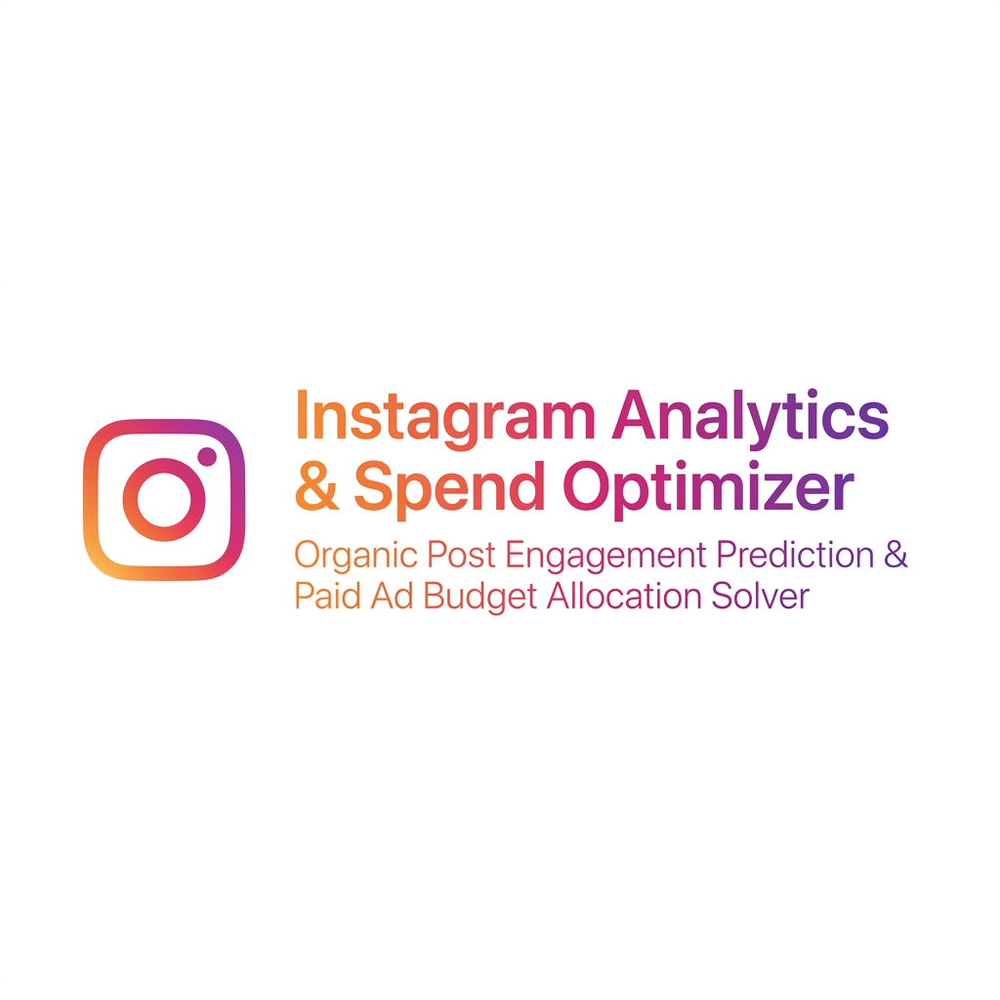
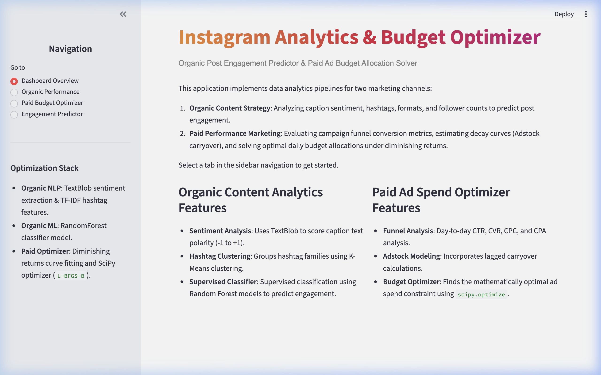
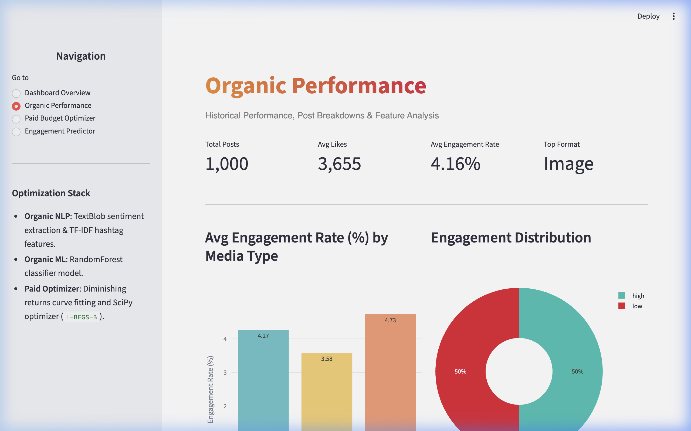
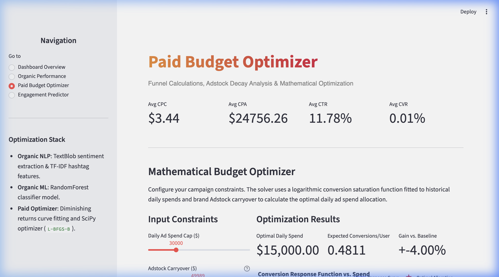
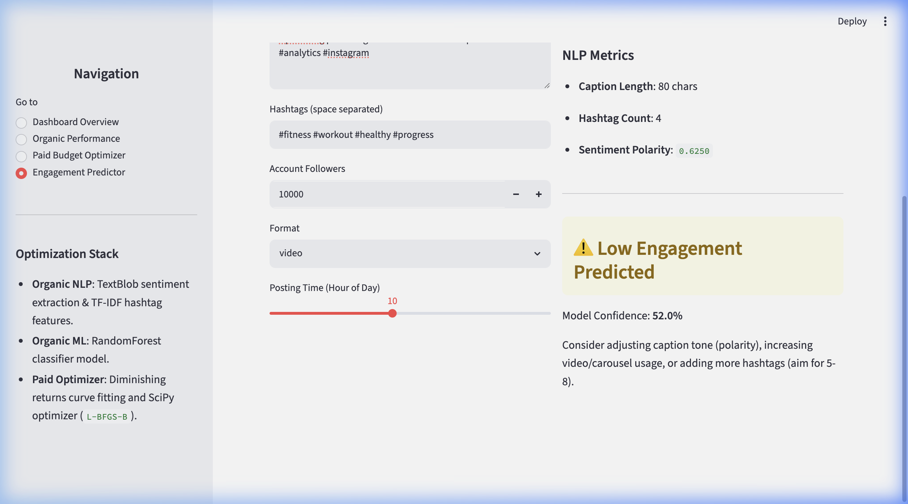

<p align="center">
  
</p>

<p align="center">
  
  
  
  
  
  
</p>

---

# Instagram Content Engagement & Marketing Ad Campaign Optimization

This repository contains a python data science pipeline and interactive dashboard for Instagram analytics. The project covers organic post engagement prediction and paid advertising optimization.

---

## 🖥️ Streamlit Control Center Screenshots

### 1. Dashboard Overview
Provides an entry point introducing the dual-track functionality (organic analysis vs. paid budget solver).
<p align="center">
  
</p>

### 2. Organic Performance Analysis
Visualizes post interaction distributions, follower engagement rates, and format-specific KPIs.
<p align="center">
  
</p>

### 3. Paid Budget Optimizer
Estimates conversion response curves incorporating historical Adstock carryover and runs the live SciPy solver to calculate the optimal ad spend.
<p align="center">
  
</p>

### 4. AI Post Engagement Predictor
Runs a supervised Random Forest classifier to score caption draft parameters (lengths, formats, text sentiment polarity, hashtag counts) to predict organic reach.
<p align="center">
  
</p>

---

## 🛠️ Repository Structure

*   `Analysis/Social_media_analytics.ipynb`: Jupyter notebook covering data cleaning, EDA, ML models, and SciPy budget optimization.
*   `Analysis/instagram_campaign_dataset.csv`: Organic posts dataset.
*   `Analysis/marketing_analytics_dataset.csv`: Paid ad spend and conversions dataset.
*   `app.py`: Streamlit web dashboard.
*   `requirements.txt`: Python package requirements.
*   `.gitignore`: Git exclusions.
*   `assets/`: Project banner and dashboard screenshots.

---

## 📈 Methodology & Mathematical Formulations

### 1. Adstock Carryover Effect
Advertising campaigns build brand memory over time. Cumulative adstock at day $t$ is calculated as:
$$A_t = S_t + \lambda A_{t-1}$$
where $S_t$ is the daily ad spend and $\lambda \in [0, 1)$ represents the decay parameter (retention rate).

### 2. Logarithmic Saturation Curve (Diminishing Returns)
To model marketing saturation (where doubling ad spend yields diminishing returns), we fit a logarithmic response curve to conversions:
$$\text{Expected Conversions} = \alpha \cdot \ln(x_{\text{ad\_spend}} + 1) + \beta \cdot A_{\text{adstock}} + C_{0}$$
The coefficients are estimated using least squares regression.

### 3. Constrained Budget Allocation Optimization
To find the optimal ad spend $x$ that maximizes conversions under a daily budget limit $B$, we solve:
$$\max_{x} \quad \alpha \cdot \ln(x + 1) + \beta \cdot A_{\text{adstock}} + C_{0}$$
$$\text{subject to} \quad 0 \le x \le B$$
This constrained optimization problem is solved using the `L-BFGS-B` algorithm via `scipy.optimize.minimize`.

---

## 🚀 Installation & Setup

1. **Install dependencies**:
   ```bash
   pip install -r requirements.txt
   ```

2. **Open the Notebook**:
   ```bash
   jupyter notebook Analysis/Social_media_analytics.ipynb
   ```

3. **Run the Streamlit Dashboard**:
   ```bash
   streamlit run app.py
   ```
